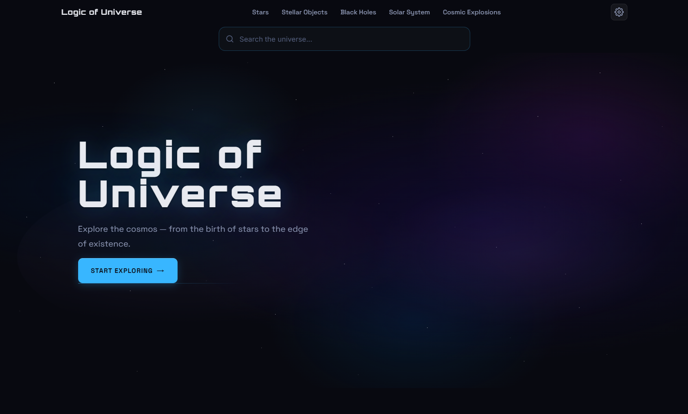
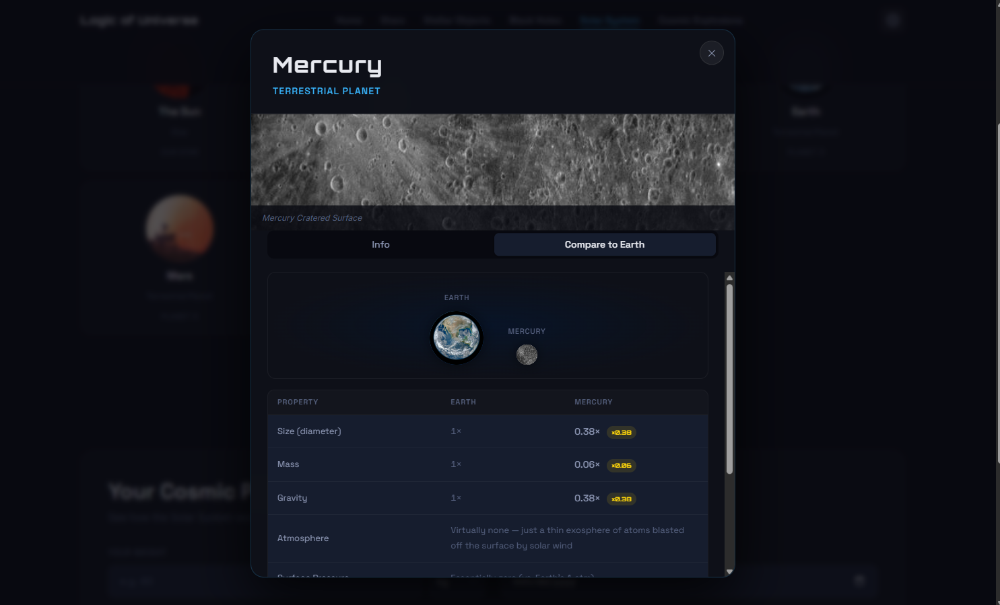
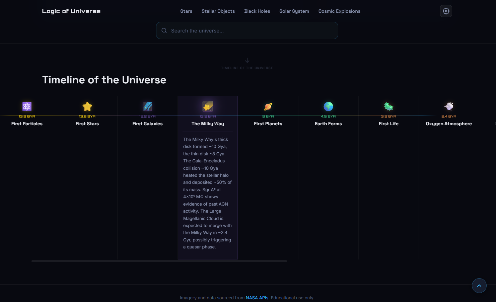
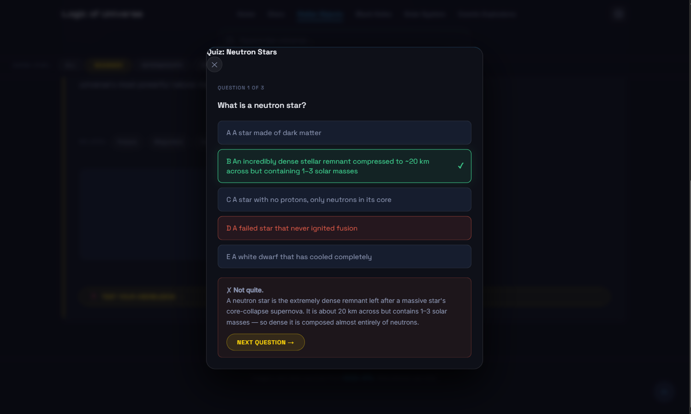
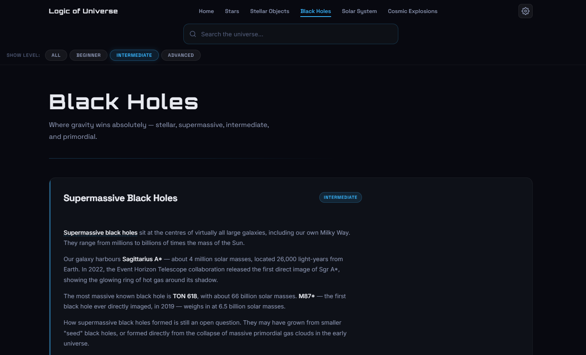
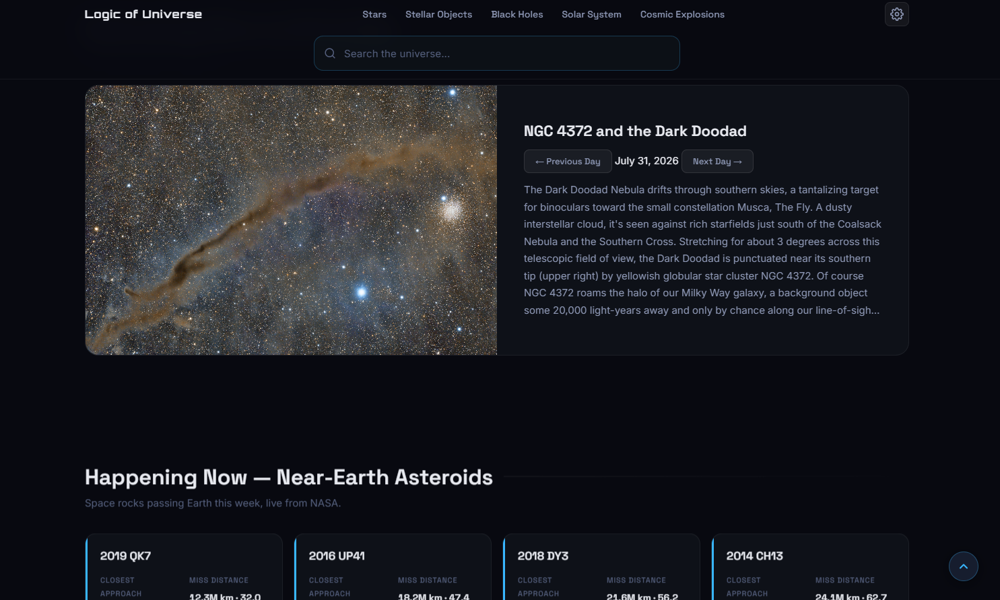
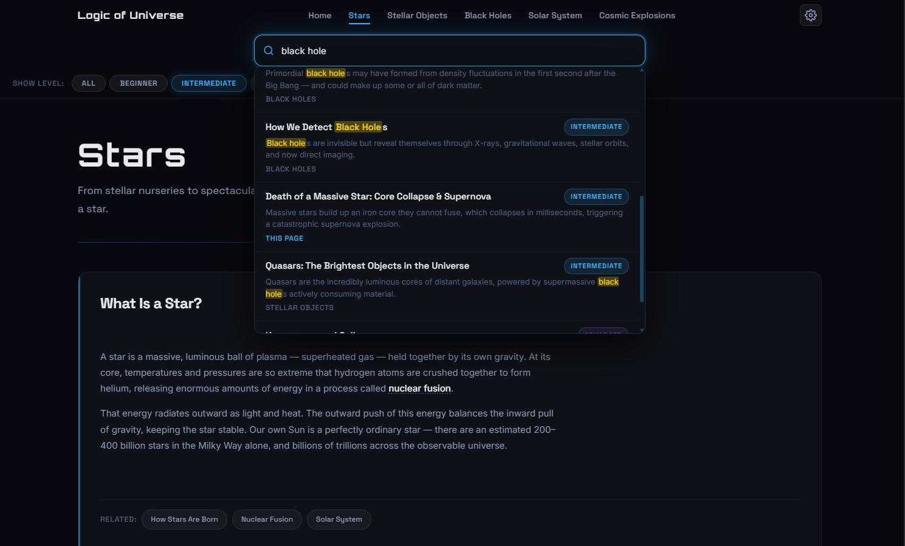

# 🌌 Logic of Universe

An interactive, free website that teaches astronomy — from beginner to advanced — through real NASA imagery, quizzes, and a scrollable timeline of the universe.

🔗 **Live demo:** https://tigerkossk.github.io/logic-of-universe/

## 🎥 Demo


## 📸 Screenshots

### Home Page


### Solar System Explorer


### Timeline of the Universe


### Quiz mode


### Topics


### Today's Events


### Search Box



## Why I built this

I've always found astronomy fascinating but most learning resources are either dry textbooks or scattered YouTube videos with no structure. I wanted one place where you could go from "what is a star" to "how do black holes actually work" at your own pace, with real NASA images instead of stock graphics. Logic of Universe is my attempt at that — a prototype I'm still actively building out.

## Features

- 🪐 **Solar System Explorer** — click any planet for real facts, images, and an Earth size/scale comparison
- 🕐 **Timeline of the Universe** — scrollable strip covering 16 major cosmic events, from the Big Bang to today
- 🧠 **Ask the Universe quiz mode** — per-topic quizzes with difficulty-aware questions
- 📖 **Glossary tooltips** — hover any bolded term across the site for an instant definition
- 🔭 **NASA APOD integration** — Astronomy Picture of the Day, with previous-day navigation
- 🎚️ **Difficulty levels** — Beginner / Intermediate / Advanced content throughout
- 🔍 **Smart search** — expandable search box with suggestions and recent-search history
- ⚙️ **Settings panel** — theme toggle, language selector, and layout preferences (saved locally)

## Tech stack

Vanilla HTML, CSS, and JavaScript (ES Modules). No framework, no build step, no dependencies.

## Running it locally

This site uses ES Modules, so it needs a local server — opening the HTML file directly (`file://`) won't work.

```bash
python -m http.server 8080
```

Then open `http://localhost:8080` in your browser.

## Status

This is an actively developed prototype. Core content, search, the Solar System Explorer, timeline, quizzes, and glossary are working; visual polish and mobile responsiveness are ongoing.

Contributions, bug reports, and suggestions are welcome — feel free to open an issue.

## License

Released under the [MIT License](LICENSE) — free to use, modify, and share, just keep the copyright notice.

---

If you find this useful, a ⭐ helps other people discover it.
